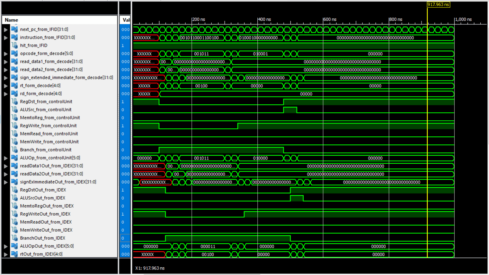
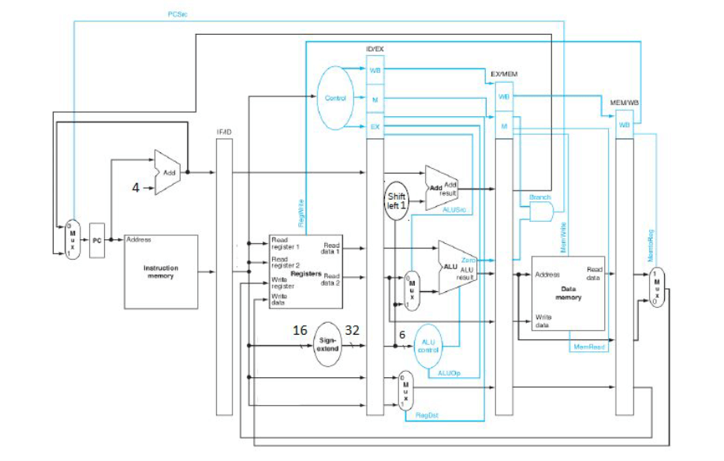

# MIPS processor in verilog

[](https://www.python.org/)
[](LICENSE)
[](https://github.com/amir-shamsi)
<a href="https://github.com/Amir-Shamsi/Multicycle-MIPS-in-Verilog" title="Repo Size">

</a>

MIPS multi cycle Verilog implementation based on Computer Organization and Design
### What instructions does it support?
An example of the codes it supports:
```
add Dist, Rsrc1, Rsrc2
sub Dist, Rsrc4, Rsrc3
----------------------
not Dist, Rsrc4
----------------------
multi Rsrc1, imm
divi Rsrc1, imm
----------------------
beq Rsrc5, Src3
bne Rsrc6, Src4
----------------------
bgt Rsrc3, Src1
bge Rsrc1, Src6
----------------------
blt Rsrc4, Src2
ble Rsrc3, Src3
----------------------
j labelJump
jal labelJump and Link
----------------------
lsl Dist, Rsrc3, Shamt
lsr Dist, Rsrc5, Shamt
----------------------
and Dist, Rsrc3, Rsrc5
or Dist, Rsrc2, Rsrc4
----------------------
slt Rsrc4, Rsrc1
----------------------
sra Rsrc3, imm
```

### Simulation
<p align="center">

</p>

<br>

### Datapath
<p align="center">

</p>

## 

### Installation
1. Clone the Repo
  ```sh
  git clone https://github.com/Amir-Shamsi/Multicycle-MIPS-in-Verilog.git
  ```
2. Run Simulate Behavioral Model for <a href="MIPS/MIPS.v"> MIPS.v </a>
3. Enjoy the pipelined processor!
